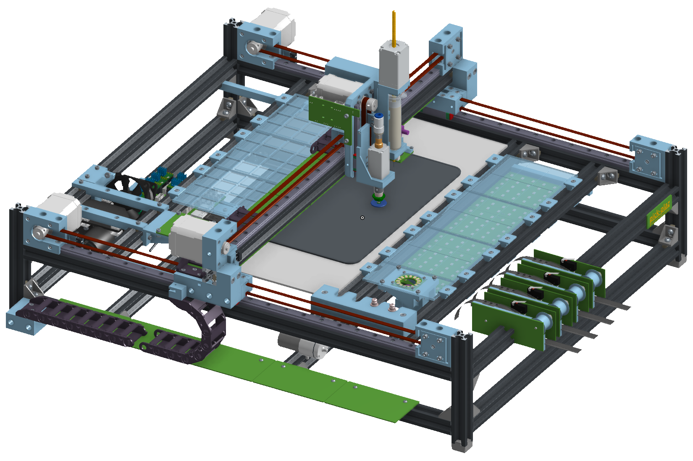

# pick-plaz
Open source pick and place machine

[CAD Onshape](https://cad.onshape.com/documents/175bb45940c329c46a77df39/w/56e16a8885c2fef63520b9e2/e/e7ab10496d879b6cf281b14f)

[STEP file repostory (CAD)](https://github.com/ftobler/pick-plaz-cad)

[More Pictures (Imgur)](https://imgur.com/a/lOQ79OQ)

## Issues

* Part preview missing zero point of ICs

# Wishlist

* Camera sharpen menu in UI (laplacian of camera image)
